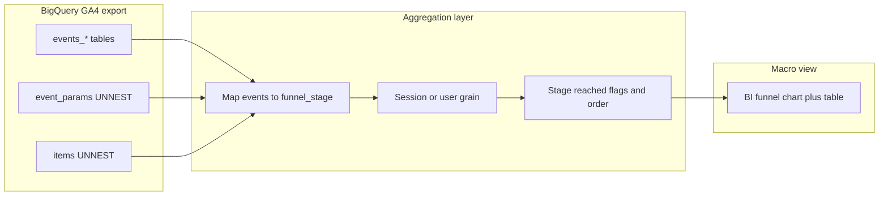

# Macro View funnel analysis plan (GA4 BigQuery sample)

*Homework Task 2 — high-level plan for using BigQuery GA4 sample ecommerce data in a macro funnel view.*

## What “Macro View” means here

- **Macro** = **4–7 stages** that map to business questions (e.g. “Did they shop?” → “Did they consider products?” → “Did they cart?” → “Did they check out?” → “Did they buy?”), not every `page_view` URL.
- **Micro** (out of scope for this macro deliverable) = path analysis, screen-by-screen Sankeys, or long `event_params.page_location` chains—useful later, but not the executive default.

## Data you will use ([`bigquery-public-data.ga4_obfuscated_sample_ecommerce`](https://console.cloud.google.com/marketplace/product/google-analytics-public-data/ga4_obfuscated_sample_ecommerce))

- **Fact table(s):** `events_YYYYMMDD` (wildcard `events_*` with `_TABLE_SUFFIX` bounds for cost control).
- **Identifiers:** Prefer **`user_pseudo_id` + `ga_session_id`** (from `event_params`) for a **session-level** macro funnel (matches “visit” intuition); optionally a **user-level** funnel (any session in window) for “did this shopper ever reach checkout in January?”—pick one and label the dashboard clearly.
- **Stage signals:** Primarily **`event_name`** (GA4 recommended ecommerce events: `view_item`, `add_to_cart`, `begin_checkout`, `add_shipping_info`, `add_payment_info`, `purchase`, plus upstream **`session_start` / `first_visit`** or **`page_view`** as optional “landed” stage). Use **`UNNEST(event_params)`** when a stage needs a URL or parameter filter; use **`UNNEST(items)`** to confirm product context or for revenue summaries where `purchase` exists.

## Step 1 — Agree on funnel definition (before SQL)

1. **List stages** (example macro chain for this dataset):  
   `Land` → `View product` (`view_item`) → `Add to cart` → `Begin checkout` → `Add shipping` → `Add payment` → `Purchase`  
   (Collapse shipping + payment into one **“Checkout details”** stage if you want fewer steps for executives.)
2. **Rules per stage:** “Counts if **at least one** qualifying event in the session” (binary reached / not), vs “must happen **in order**” (stricter macro—state which you use).
3. **Entry cohort:** e.g. all sessions with `session_start` in date range, or sessions with any `page_view`—define so denominators are stable.

## Step 2 — Build a staging mapping in BigQuery

- **Extract session id:** `(SELECT value.int_value FROM UNNEST(event_params) WHERE key = 'ga_session_id' LIMIT 1)` (or string coalesce if your export varies).
- **Derive `funnel_stage`:** `CASE` / mapping table from `event_name` to one of the macro labels; keep `event_timestamp` for ordering.
- **Session-level long table:** one row per `(session_key, funnel_stage)` with `first_hit_ts` = `MIN(event_timestamp)` for that stage in the session (and optionally `last_hit_ts`).
- **Session-level wide flags:** pivot to columns `reached_view_item`, `reached_add_to_cart`, … or store **max stage order** reached if you enforce strict ordering.

## Step 3 — Macro metrics (what leadership sees)

- **Stage counts:** sessions (or users) that **reached** each stage.
- **Step conversion:** `reached_stage_n / reached_stage_n_minus_1` (use the same population definition for numerator and denominator).
- **Overall funnel conversion:** sessions with `purchase` / sessions entered.
- **Drop-off:** complement of conversion between adjacent stages; add **median time** between stage `first_hit_ts` only if you want one extra diagnostic without going micro.
- **Optional breakdowns (still macro):** `device.category`, `geo.country`, `traffic_source.medium`—only if cardinality is low after bucketing “(not set)” / “Other”.

## Step 4 — Output shape for a BI “macro funnel”

- **Preferred export:** a **small aggregated table** (e.g. one row per `event_date` × optional segment × stage with `entered`, `advanced`, `converted`) or a **session-level summary** table with boolean columns—either works in Tableau/Power BI/Looker.
- **Avoid** pushing millions of raw events into the BI tool for the macro view; **aggregate in BigQuery**, visualize aggregates (aligns with Task 3 research on performance and clarity).

## Step 5 — Quality checks (short, before trusting the chart)

- **Coverage:** event counts per `event_name` for the date window; confirm `purchase` volume is non-zero.
- **Ordering sanity:** sample a few sessions where `purchase` = true and verify `begin_checkout` occurred earlier in the same session (if using strict order).
- **Duplicates:** multiple `begin_checkout` events per session are normal—**first occurrence** per stage is usually the right macro rule.

## Limitations to state in the write-up (honesty for “macro” claims)

- **Public sample:** time range and traffic are not your business; use as **methodology demo**, not benchmarks for a real brand.
- **Obfuscation / consent:** treat segments as illustrative.
- **Identity:** `user_pseudo_id` is device-centric; macro “user” funnels are approximate.

## Deliverable for Task 2 (what you hand in)

- **One page:** stage definitions + grain (session vs user) + metric definitions + sketch of the BigQuery logic (CTEs) + what the BI chart will show.
- **Optional:** a single “example insight” sentence (“If we define macro stages as …, X% of sessions that viewed a product added to cart in this sample window”).

## Checklist (from planning session)

- [ ] Lock 4–7 macro stages and map each to `event_name` (+ param filters if needed)
- [ ] Choose session-level vs user-level funnel and entry rule (denominator cohort)
- [ ] Design BigQuery: session key, `UNNEST` for `ga_session_id`, `first_hit_ts` per stage, wide flags or long tidy export
- [ ] Define conversion, drop-off, and optional median time between stages
- [ ] Specify BI output (aggregated table shape) and 1–3 macro breakdown dimensions
- [ ] Document sample-data caveats for the homework narrative

---

*Note: This file mirrors the substance of the Cursor plan export; GitHub renders Mermaid in markdown where enabled.*
